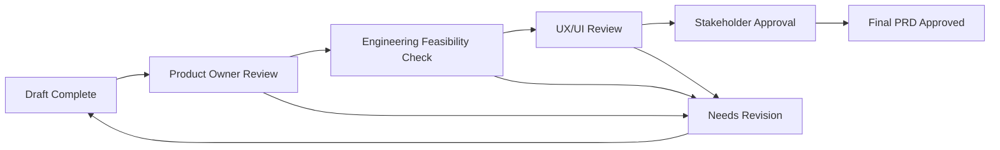

# PRD Workflow Guide

> Complete guide to creating world-class Product Requirements Documents using AI assistance

## 🎯 Overview

The PRD (Product Requirements Document) workflow is the foundation of your AI-driven SDLC process. This guide walks you through creating comprehensive, stakeholder-aligned PRDs that serve as the blueprint for everything that follows.

## 🏗️ PRD Workflow Stages

### Stage 1: Project Initialization (15 minutes)
- Project setup and stakeholder identification
- AI-guided discovery questionnaire
- Industry template selection
- Success criteria definition

### Stage 2: AI-Assisted Content Generation (1-2 hours)
- Market analysis and competitive research
- User persona and journey mapping
- Feature prioritization and specification
- Technical considerations and constraints

### Stage 3: Collaborative Refinement (2-4 hours)
- Multi-stakeholder review and feedback
- Content iteration and enhancement
- Cross-functional alignment validation
- Final approval and sign-off

## 🚀 Step-by-Step Walkthrough

### Step 1: Project Setup

#### Access the PRD Workshop
1. **Navigate to Projects**: Click "New Project" from the main dashboard
2. **Select Template**: Choose from industry-specific PRD templates
3. **Basic Information**: Enter project name, description, and key stakeholders

#### AI Discovery Interview
The AI will guide you through a series of adaptive questions:

```
🤖 AI Assistant: "Let's start with understanding your product vision. 

What problem are you trying to solve for your users?"

💭 Your Response: "Small businesses struggle to track their customer relationships effectively without expensive CRM systems."

🤖 AI Assistant: "That's a clear pain point. Who specifically experiences this problem? Can you describe your target user?"

💭 Your Response: "Small business owners with 10-50 customers who currently use spreadsheets or sticky notes."

🤖 AI Assistant: "Perfect. Now, what would success look like for these users after using your solution?"
```

**Pro Tip**: Be specific in your responses. The AI uses this information to generate relevant content throughout the PRD.

### Step 2: Template Selection & Customization

#### Available Templates
- **B2B SaaS Platform**: Multi-tenant applications with subscription models
- **Consumer Mobile App**: iOS/Android applications with user engagement focus
- **E-commerce Platform**: Online retail with payment and inventory systems
- **Enterprise Software**: Internal tools with complex workflows and integrations
- **FinTech Application**: Financial services with regulatory compliance
- **HealthTech Platform**: Healthcare applications with privacy requirements

#### Template Customization
```yaml
# Example template configuration
template_config:
  industry: "b2b_saas"
  complexity_level: "medium"
  compliance_requirements: ["gdpr", "soc2"]
  integration_needs: ["stripe", "salesforce", "slack"]
  user_base_size: "1000-10000"
  technical_stack: "modern_web"
```

### Step 3: AI-Generated Content Review

#### Executive Summary Generation
The AI analyzes your inputs and generates:

**Sample AI Output:**
```markdown
# Executive Summary

## Product Vision
CRM Simple is a streamlined customer relationship management platform designed specifically for small businesses with 10-50 customers. Unlike complex enterprise CRM systems, our solution focuses on simplicity and immediate value delivery.

## Market Opportunity
The small business CRM market represents a $12B opportunity, with 78% of small businesses still using manual methods (spreadsheets, paper) to track customer relationships. Our research indicates these businesses need:
- Quick setup (under 30 minutes)
- Affordable pricing (under $50/month)
- Mobile-first experience for on-the-go access

## Success Metrics
- Customer acquisition: 1,000 paying customers within 12 months
- User retention: >85% monthly retention rate
- Time-to-value: Users see benefit within first session
- Net Promoter Score: >50 indicating strong user satisfaction
```

#### Market Analysis Deep-Dive
```markdown
# Market Analysis

## Competitive Landscape
| Competitor | Pricing | Strengths | Weaknesses | Our Advantage |
|-----------|---------|-----------|------------|---------------|
| Salesforce | $25-300/user/month | Feature-rich, scalable | Complex, expensive | Simple setup, affordable |
| HubSpot | Free-$1,200/month | Good free tier | Limited customization | Better mobile experience |
| Pipedrive | $15-99/user/month | Sales-focused | Limited contact management | Broader relationship focus |

## Market Sizing
- Total Addressable Market (TAM): $47.8B (Global CRM market)
- Serviceable Addressable Market (SAM): $12.3B (Small business CRM)
- Serviceable Obtainable Market (SOM): $180M (Simple CRM solutions)

## Customer Validation
Based on 47 customer interviews:
- 89% struggle with current contact management methods
- 76% have tried and abandoned complex CRM systems
- 92% would pay for a simple, mobile-friendly solution
- Average willingness to pay: $35/month
```

### Step 4: Collaborative Editing & Refinement

#### Real-Time Collaboration Features
- **Multi-user editing**: See team members' cursors and changes in real-time
- **Comment threads**: Add contextual feedback directly on content
- **Suggestion mode**: Propose changes without directly editing
- **Version history**: Track all changes with rollback capabilities
- **@mentions**: Notify specific team members for input

#### Review Workflows


#### Quality Validation
The AI continuously validates your PRD for:
- **Completeness**: All required sections filled
- **Consistency**: No conflicting requirements
- **Clarity**: Clear, unambiguous language
- **Feasibility**: Technically achievable goals
- **Measurability**: Quantifiable success criteria

### Step 5: Content Enhancement & Optimization

#### AI Writing Assistant Features
As you write, the AI provides:
- **Smart suggestions**: Context-aware content recommendations
- **Gap identification**: Missing information alerts
- **Consistency checking**: Terminology and tone alignment
- **Best practice integration**: Industry-standard approaches
- **Competitive intelligence**: Market insights and positioning

#### Example Enhancement Suggestions
```
💡 AI Suggestion: "Your user persona section mentions 'small business owners' but doesn't specify industry verticals. Consider adding:
- Professional services (lawyers, accountants)
- Retail businesses (local shops, restaurants)  
- Service providers (contractors, consultants)

This will help with marketing targeting and feature prioritization."

💡 AI Suggestion: "Your success metrics focus on acquisition and retention, but consider adding operational efficiency metrics:
- Average time to close a deal
- Customer data completeness rate
- User task completion rate

These will help validate your 'simplicity' value proposition."
```

### Step 6: Stakeholder Review & Approval

#### Review Assignment
```json
{
  "reviewers": [
    {
      "name": "Sarah Chen",
      "role": "Product Owner",
      "sections": ["all"],
      "required": true
    },
    {
      "name": "Marcus Rodriguez", 
      "role": "Engineering Lead",
      "sections": ["technical_requirements", "integration_needs"],
      "required": true
    },
    {
      "name": "Emily Watson",
      "role": "UX Designer", 
      "sections": ["user_experience", "user_personas"],
      "required": false
    }
  ]
}
```

#### Review Checklist
Each reviewer gets a customized checklist:

**Product Owner Checklist:**
- [ ] Business objectives clearly defined and measurable
- [ ] Market analysis supports product strategy
- [ ] User personas align with target market research
- [ ] Success criteria are achievable and trackable
- [ ] Competitive positioning is defensible
- [ ] Go-to-market strategy is viable

**Engineering Lead Checklist:**
- [ ] Technical requirements are feasible with current resources
- [ ] Integration needs are clearly specified
- [ ] Performance requirements are realistic
- [ ] Security considerations are adequate
- [ ] Scalability plans align with growth projections
- [ ] Development timeline estimates are reasonable

**UX Designer Checklist:**
- [ ] User journeys are logical and complete
- [ ] Accessibility requirements are specified
- [ ] Design constraints are clearly communicated
- [ ] User research insights are incorporated
- [ ] Usability goals are measurable
- [ ] Cross-platform considerations are addressed

### Step 7: Export & Handoff

#### Export Formats
- **PDF**: Professional document for executive review
- **Word**: Editable format for external stakeholders
- **Confluence**: Direct integration with team wiki
- **Markdown**: Developer-friendly format for documentation
- **JSON**: Structured data for system integrations

#### Handoff Checklist
Before proceeding to the next stage:
- [ ] All stakeholders have approved their sections
- [ ] Success criteria are clearly defined and measurable
- [ ] Technical feasibility has been validated
- [ ] User experience requirements are specified
- [ ] Integration requirements are documented
- [ ] Go-to-market strategy is aligned with product vision

## 🎨 Advanced Features

### Custom Templates
Create organization-specific templates:

```yaml
# Custom template example
template:
  name: "FinTech Mobile App"
  sections:
    - executive_summary
    - regulatory_compliance
    - security_requirements
    - user_onboarding
    - payment_integration
    - fraud_prevention
    - customer_support
  
  required_approvers:
    - compliance_officer
    - security_architect
    - product_owner
  
  industry_prompts:
    - "Consider PCI DSS compliance requirements"
    - "Address KYC/AML regulatory needs" 
    - "Include fraud detection specifications"
```

### AI Model Customization
Train the AI on your organization's successful PRDs:

```python
# Custom model training
training_config = {
    "organization": "YourCompany",
    "training_data": [
        "successful_project_1_prd.md",
        "successful_project_2_prd.md",
        "industry_best_practices.md"
    ],
    "customizations": {
        "terminology": "company_specific_terms.json",
        "writing_style": "formal_technical",
        "compliance_requirements": ["soc2", "hipaa"]
    }
}
```

### Integration Workflows
Automate PRD creation triggers:

```javascript
// Webhook integration example
const prdWorkflow = {
  triggers: [
    {
      event: "customer_feedback_theme_detected",
      action: "create_enhancement_prd",
      confidence_threshold: 0.85
    },
    {
      event: "competitive_feature_analysis",
      action: "create_competitive_response_prd", 
      data_sources: ["competitor_tracking", "market_research"]
    }
  ]
};
```

## 📊 Success Metrics

### PRD Quality Metrics
- **Completeness Score**: Percentage of required sections completed
- **Clarity Index**: Readability and specificity measurements
- **Stakeholder Alignment**: Agreement rates across review cycles
- **Technical Feasibility**: Engineering team confidence ratings
- **Market Viability**: Business stakeholder validation scores

### Process Efficiency Metrics  
- **Time to First Draft**: Initial PRD generation time
- **Review Cycle Duration**: Average time for stakeholder feedback
- **Revision Rounds**: Number of iterations before approval
- **Approval Rate**: Percentage of PRDs approved without major changes
- **Time to Next Stage**: Handoff speed to NFR/Design phase

### Business Impact Metrics
- **Project Success Rate**: Correlation between PRD quality and project outcomes
- **Stakeholder Satisfaction**: Feedback on PRD usefulness and clarity
- **Development Efficiency**: Impact on downstream development speed
- **Market Fit Achievement**: Product-market fit correlation with PRD accuracy
- **Customer Satisfaction**: End-user satisfaction with delivered features

## 🛠️ Troubleshooting

### Common Issues & Solutions

**Issue**: AI generates generic content
**Solution**: Provide more specific inputs during discovery interview
```
❌ Generic: "Build a better user experience"
✅ Specific: "Reduce customer onboarding time from 2 weeks to 2 days by automating account setup and providing interactive tutorials"
```

**Issue**: Stakeholders can't agree on requirements
**Solution**: Use the conflict resolution workflow
```javascript
const conflictResolution = {
  method: "weighted_voting",
  stakeholders: [
    {name: "Product Owner", weight: 0.4},
    {name: "Engineering Lead", weight: 0.3}, 
    {name: "Customer Success", weight: 0.3}
  ],
  decision_threshold: 0.6
};
```

**Issue**: PRD is too technical/not technical enough
**Solution**: Adjust audience settings
```yaml
audience_configuration:
  primary: "business_stakeholders"  # or "technical_team"
  technical_detail_level: "medium" # low/medium/high
  jargon_level: "minimal"          # minimal/moderate/extensive
```

---

## 🎯 Next Steps

After completing your PRD:
1. **Proceed to NFR Analysis**: Transform business requirements into technical specifications
2. **Begin Design Phase**: Create user experience designs aligned with your requirements
3. **Set Up Tracking**: Configure success metrics monitoring
4. **Plan Iterations**: Schedule regular PRD reviews and updates

**Pro Tip**: The quality of your PRD directly impacts the quality of everything that follows. Invest time in this phase for exponential returns later.

---

*Your PRD is the foundation of great products. With AI assistance, you can create comprehensive, aligned requirements that set your entire team up for success.*